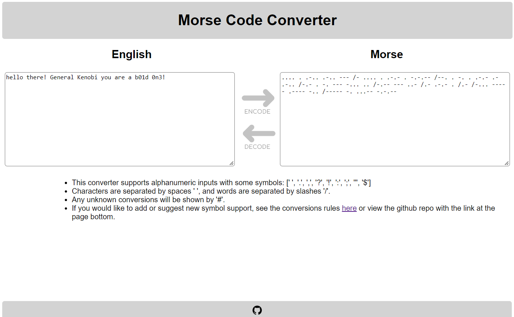

# Morse Code Converter

- Convert English to Morse Code
- Check out the website [here](https://xdwightsbeetsx.github.io/morse-conv/)
- Update supported symbols [here](https://github.com/XDwightsBeetsX/morse-conv/blob/master/js/conversions.js)

## Character Support

| Category | Support |
| :-- | :-- |
| English Characters | `[A - z]` |
| English Symbols | `[. , ; : ! ?]` |
| Numbers | `[0-9]` |
| Math | `[+ - / =]` |
| Currency | `[$]` |
| Unsupported | `[#]` |
